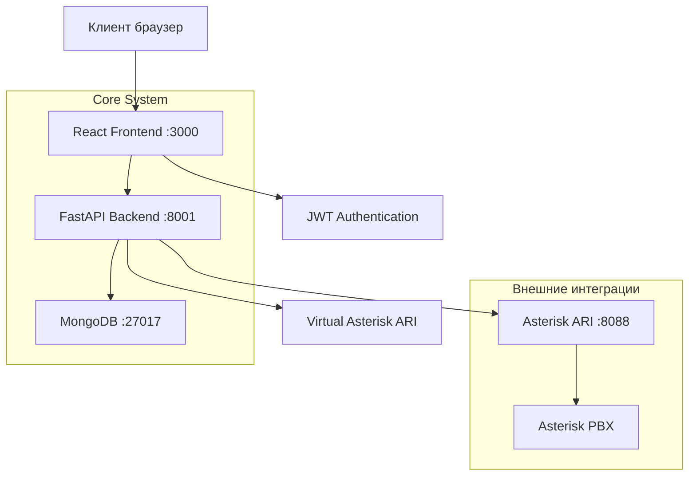
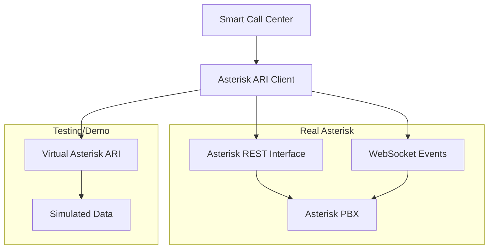

# 📞 Smart Call Center - Техническая документация

## 📋 Содержание

1. [Обзор проекта](#обзор-проекта)
2. [Архитектура системы](#архитектура-системы)
3. [Backend документация](#backend-документация)
4. [Frontend документация](#frontend-документация)
5. [База данных](#база-данных)
6. [API справочник](#api-справочник)
7. [Интеграция с Asterisk](#интеграция-с-asterisk)
8. [Развертывание](#развертывание)
9. [Безопасность](#безопасность)
10. [Руководство пользователя](#руководство-пользователя)

---

## 🎯 Обзор проекта

### Назначение
Smart Call Center - это современная веб-система для управления колл-центром с интеграцией Asterisk PBX. Система предоставляет полный функционал для мониторинга звонков, управления операторами, аналитики и администрирования.

### Ключевые функции
- **Управление пользователями**: Создание и администрирование операторов, менеджеров, супервайзеров
- **Интеграция с Asterisk**: Реальное подключение к Asterisk ARI для управления звонками
- **Аналитика и отчеты**: Детальная статистика звонков и производительности
- **Ролевая система**: Четыре уровня доступа (Админ, Менеджер, Супервайзер, Оператор)
- **Виртуальное тестирование**: Встроенный виртуальный Asterisk для демонстрации и тестирования

### Технический стек
- **Frontend**: React 19, TypeScript, Tailwind CSS, shadcn/ui
- **Backend**: FastAPI (Python), Async/Await
- **База данных**: MongoDB с Motor (async driver)
- **Интеграция**: Asterisk ARI (REST API + WebSocket)
- **Авторизация**: JWT токены
- **Развертывание**: Docker Compose

---

## 🏗️ Архитектура системы

### Общая архитектура



### Компоненты системы

#### Frontend Layer (React)
- **Компоненты UI**: Переиспользуемые компоненты интерфейса
- **Страницы**: Dashboard, Reports, Admin Panel, Operator Workspace
- **Контекст авторизации**: Управление состоянием аутентификации
- **API Service**: Централизованная обработка запросов к backend

#### Backend Layer (FastAPI)
- **API Routes**: RESTful endpoints для всех операций
- **Authentication**: JWT токены и ролевая авторизация
- **Database Layer**: Асинхронные операции с MongoDB
- **Asterisk Integration**: ARI клиент для управления звонками
- **Virtual ARI**: Встроенная имитация Asterisk для тестирования

#### Data Layer
- **MongoDB**: Основная база данных
- **Collections**: Users, Groups, Queues, Operators, Calls, Settings
- **Indexes**: Оптимизированные индексы для производительности

---

## 🖥️ Backend документация

### Структура проекта

```
backend/
├── server.py              # Главный файл приложения FastAPI
├── models.py              # Pydantic модели данных
├── database.py            # Менеджер базы данных MongoDB
├── auth.py                # Система авторизации и JWT
├── asterisk_client.py     # Клиент для Asterisk ARI
├── virtual_asterisk_ari.py # Виртуальный Asterisk для тестирования
├── db.py                  # Dependency injection для базы данных
├── requirements.txt       # Python зависимости
├── .env                   # Переменные окружения
└── routes/               # API маршруты
    ├── auth_routes.py     # Авторизация
    ├── admin_routes.py    # Администрирование
    ├── call_routes.py     # Управление звонками
    ├── operator_routes.py # Операторы
    ├── queue_routes.py    # Очереди
    ├── dashboard_routes.py # Dashboard данные
    └── asterisk_routes.py # Asterisk интеграция
```

### Основные модули

#### 1. server.py - Главное приложение
```python
# Основные функции:
- FastAPI приложение с CORS
- Подключение всех роутеров
- Инициализация базы данных
- Создание admin пользователя
- Настройка middleware
```

**Ключевые функции:**
- `get_db()`: Dependency injection для базы данных
- `initialize_default_data()`: Создание admin пользователя
- `lifespan()`: Управление жизненным циклом приложения

#### 2. models.py - Модели данных
```python
# Основные модели:
- User: Пользователи системы
- Operator: Операторы с extensions
- Queue: Очереди звонков
- Call: Записи звонков
- SystemSettings: Настройки системы
- AsteriskConfig: Конфигурация Asterisk
```

**Enum классы:**
- `UserRole`: admin, manager, supervisor, operator
- `CallStatus`: incoming, answered, completed, missed
- `OperatorStatus`: online, busy, offline

#### 3. database.py - Менеджер БД
```python
class DatabaseManager:
    # Основные методы:
    - get_user_by_username(): Поиск пользователя
    - create_user(): Создание пользователя
    - update_system_settings(): Обновление настроек
    - create_operator(): Создание оператора
    - get_call_stats(): Статистика звонков
```

**Коллекции MongoDB:**
- `users`: Пользователи системы
- `operators`: Операторы с extensions
- `groups`: Группы пользователей
- `queues`: Очереди звонков
- `calls`: История звонков
- `settings`: Системные настройки

#### 4. auth.py - Авторизация
```python
# Функции авторизации:
- create_access_token(): Создание JWT токена
- verify_password(): Проверка пароля
- get_current_user(): Получение текущего пользователя
- require_admin(): Проверка прав администратора
```

**Система ролей:**
- **Admin**: Полный доступ к системе
- **Manager**: Просмотр отчетов и аналитики
- **Supervisor**: Управление группой операторов
- **Operator**: Обработка звонков

#### 5. asterisk_client.py - Asterisk ARI
```python
class AsteriskARIClient:
    # Основные методы:
    - connect(): Подключение к Asterisk
    - test_connection(): Тестирование соединения
    - get_channels(): Получение активных каналов
    - originate_call(): Инициация звонка
    - answer_channel(): Ответ на звонок
    - hangup_channel(): Завершение звонка
```

#### 6. virtual_asterisk_ari.py - Виртуальный Asterisk
```python
class VirtualAsteriskARI:
    # Имитирует реальный Asterisk для:
    - Демонстрации функционала
    - Тестирования без реального Asterisk
    - Разработки и отладки
    
    # Генерирует реалистичные данные:
    - Extensions (1001, 1002, 1003, 2001, 2002)
    - Queues (general, support, sales)
    - Call events (StasisStart, ChannelStateChange)
```

### API маршруты

#### Auth Routes (`/api/auth/`)
- `POST /login`: Авторизация пользователя
- `GET /me`: Информация о текущем пользователе
- `POST /logout`: Выход из системы

#### Admin Routes (`/api/admin/`)
- `GET /users`: Список пользователей
- `POST /users`: Создание пользователя
- `PUT /users/{id}`: Обновление пользователя
- `DELETE /users/{id}`: Удаление пользователя
- `GET /settings`: Системные настройки
- `PUT /settings`: Обновление настроек
- `POST /settings/asterisk/test`: Тест соединения Asterisk

#### Dashboard Routes (`/api/dashboard/`)
- `GET /stats`: Основная статистика
- `GET /realtime`: Данные реального времени
- `GET /call-analytics`: Аналитика звонков
- `GET /operator-activity`: Активность операторов

#### Asterisk Routes (`/api/asterisk/`)
- `GET /extensions`: Список extensions
- `GET /queues`: Информация об очередях
- `GET /realtime-data`: Данные реального времени
- `POST /channels/{id}/answer`: Ответ на звонок
- `POST /channels/{id}/hangup`: Завершение звонка

---

## 🎨 Frontend документация

### Структура проекта

```
frontend/src/
├── components/           # React компоненты
│   ├── ui/              # Базовые UI компоненты (shadcn/ui)
│   ├── admin/           # Административные компоненты
│   ├── dashboard/       # Компоненты dashboard
│   ├── reports/         # Отчеты и аналитика
│   └── Layout.js        # Основной макет
├── context/             # React контексты
│   └── AuthContext.js   # Контекст авторизации
├── hooks/               # Пользовательские хуки
│   └── use-toast.js     # Хук для уведомлений
├── services/            # Внешние сервисы
│   └── api.js           # API клиент
├── lib/                 # Утилиты
│   └── utils.js         # Общие функции
├── App.js              # Главный компонент
└── index.js            # Точка входа
```

### Основные компоненты

#### 1. Layout.js - Основной макет
```javascript
// Функционал:
- Боковая навигация
- Верхняя панель с профилем
- Переключатель темы
- Breadcrumbs навигация
- Responsive дизайн
```

**Навигационные элементы:**
- Dashboard: Главная страница с метриками
- Reports: Отчеты и аналитика  
- Operators: Управление операторами
- Admin: Панель администратора (только для админов)

#### 2. AuthContext.js - Контекст авторизации
```javascript
// Управляет:
- Состояние аутентификации
- JWT токен в localStorage
- Информация о пользователе
- Функции login/logout
- Проверка ролей
```

#### 3. AdminPanel.js - Панель администратора
```javascript
// Содержит вкладки:
- Настройки системы (AdminSettings)
- Управление пользователями (UserManagement)

// Доступно только для role: "admin"
```

#### 4. AdminSettings.js - Настройки системы
```javascript
// Разделы настроек:
- Asterisk конфигурация
- Системные параметры
- Тестирование соединений
- Сохранение настроек

// Функции:
- loadSettings(): Загрузка настроек
- saveSettings(): Сохранение настроек  
- testAsteriskConnection(): Тест Asterisk
- testDatabaseConnection(): Тест БД
```

#### 5. UserManagement.js - Управление пользователями
```javascript
// Функционал:
- Список всех пользователей
- Создание нового пользователя
- Редактирование пользователя
- Удаление пользователя
- Привязка extension к операторам

// Валидация:
- Extension обязателен для операторов
- Уникальность username и email
- Проверка extensions на дубликаты
```

#### 6. Dashboard.js - Главная панель
```javascript
// Отображает:
- KPI карточки (звонки, ответы, пропущенные)
- Графики активности
- Статус операторов
- Реальные данные

// Обновление:
- Автообновление каждые 30 секунд
- Фильтры по периодам
- Responsive графики
```

### UI компоненты (shadcn/ui)

#### Базовые компоненты
- `Button`: Кнопки с вариантами стилей
- `Input`: Поля ввода с валидацией
- `Card`: Карточки контента
- `Badge`: Бейджи статусов
- `Alert`: Уведомления и предупреждения
- `Select`: Выпадающие списки
- `Tabs`: Переключаемые вкладки

#### Специальные компоненты
- `DetailedErrorDialog`: Детальные ошибки с логами
- `LoadingSpinner`: Индикаторы загрузки
- `ToastProvider`: Система уведомлений

### Сервисы

#### api.js - API клиент
```javascript
// Конфигурация:
const api = axios.create({
  baseURL: API_BASE_URL,
  headers: { 'Content-Type': 'application/json' }
});

// Интерцепторы:
- Автоматическое добавление JWT токена
- Обработка ошибок авторизации
- Логирование запросов

// Группы методов:
- authAPI: Авторизация
- adminAPI: Администрирование  
- dashboardAPI: Dashboard данные
- operatorAPI: Операторы
```

---

## 🗄️ База данных

### MongoDB коллекции

#### Users - Пользователи
```javascript
{
  id: "uuid",
  username: "string",     // Уникальный логин
  email: "string",        // Email адрес
  name: "string",         // Полное имя
  password_hash: "string", // Хеш пароля (bcrypt)
  role: "enum",           // admin|manager|supervisor|operator
  group_id: "string?",    // ID группы (опционально)
  is_active: "boolean",   // Активен ли пользователь
  created_at: "datetime",
  updated_at: "datetime"
}
```

#### Operators - Операторы
```javascript
{
  id: "uuid",
  user_id: "string",      // Связь с Users
  extension: "string",    // Номер extension в Asterisk
  group_id: "string?",    // ID группы
  status: "enum",         // online|busy|offline
  skills: ["string"],     // Навыки оператора
  max_concurrent_calls: "number", // Макс одновременных звонков
  current_calls: "number", // Текущие звонки
  last_activity: "datetime",
  created_at: "datetime"
}
```

#### Calls - Звонки
```javascript
{
  id: "uuid",
  channel_id: "string",   // ID канала Asterisk
  caller_number: "string", // Номер звонящего
  called_number: "string", // Вызываемый номер
  operator_id: "string?", // ID оператора (если назначен)
  queue_id: "string?",    // ID очереди
  status: "enum",         // incoming|answered|completed|missed
  start_time: "datetime", // Время начала звонка
  answer_time: "datetime?", // Время ответа
  end_time: "datetime?",  // Время завершения
  duration: "number?",    // Длительность в секундах
  recording_url: "string?", // URL записи
  notes: "string?",       // Заметки оператора
  created_at: "datetime"
}
```

#### Queues - Очереди
```javascript
{
  id: "uuid", 
  name: "string",         // Название очереди
  description: "string",  // Описание
  asterisk_name: "string", // Имя в Asterisk
  max_wait_time: "number", // Макс время ожидания (сек)
  priority: "number",     // Приоритет очереди
  strategy: "string",     // Стратегия распределения
  members: ["string"],    // Участники очереди
  is_active: "boolean",
  created_at: "datetime"
}
```

#### Settings - Настройки системы
```javascript
{
  id: "uuid",
  call_recording: "boolean",      // Запись звонков
  auto_answer_delay: "number",    // Задержка автоответа
  max_call_duration: "number",    // Макс длительность звонка
  queue_timeout: "number",        // Таймаут очереди
  callback_enabled: "boolean",    // Включен ли callback
  sms_notifications: "boolean",   // SMS уведомления
  email_notifications: "boolean", // Email уведомления
  asterisk_config: {              // Конфигурация Asterisk
    host: "string",
    port: "number", 
    username: "string",
    password: "string",
    protocol: "string",
    timeout: "number",
    enabled: "boolean"
  },
  updated_by: "string",           // ID пользователя
  updated_at: "datetime"
}
```

### Индексы базы данных
```javascript
// Users
db.users.createIndex({ username: 1 }, { unique: true })
db.users.createIndex({ email: 1 }, { unique: true })
db.users.createIndex({ role: 1 })

// Operators  
db.operators.createIndex({ user_id: 1 }, { unique: true })
db.operators.createIndex({ extension: 1 }, { unique: true })
db.operators.createIndex({ status: 1 })

// Calls
db.calls.createIndex({ start_time: -1 })
db.calls.createIndex({ operator_id: 1, start_time: -1 })
db.calls.createIndex({ status: 1 })
```

---

## 📡 API справочник

### Авторизация

#### POST /api/auth/login
Авторизация пользователя в системе

**Запрос:**
```json
{
  "username": "admin",
  "password": "admin"
}
```

**Ответ:**
```json
{
  "access_token": "eyJhbGciOiJIUzI1NiIs...",
  "token_type": "bearer", 
  "expires_in": 1440,
  "user": {
    "id": "uuid",
    "username": "admin",
    "email": "admin@callcenter.com",
    "name": "Системный администратор",
    "role": "admin",
    "is_active": true
  }
}
```

#### GET /api/auth/me
Получение информации о текущем пользователе

**Заголовки:**
```
Authorization: Bearer <access_token>
```

**Ответ:**
```json
{
  "id": "uuid",
  "username": "admin", 
  "email": "admin@callcenter.com",
  "name": "Системный администратор",
  "role": "admin",
  "group_id": null,
  "is_active": true,
  "created_at": "2025-01-01T00:00:00Z"
}
```

### Администрирование

#### GET /api/admin/users
Получение списка всех пользователей (только admin)

**Параметры:**
- `skip`: int = 0 - Пропустить записей
- `limit`: int = 100 - Ограничение записей

**Ответ:**
```json
[
  {
    "id": "uuid",
    "username": "operator1",
    "email": "operator1@callcenter.com", 
    "name": "Оператор 1",
    "role": "operator",
    "group_id": "group_uuid",
    "is_active": true,
    "created_at": "2025-01-01T00:00:00Z"
  }
]
```

#### POST /api/admin/users
Создание нового пользователя (только admin)

**Запрос:**
```json
{
  "username": "operator1",
  "email": "operator1@callcenter.com",
  "name": "Оператор 1", 
  "password": "operator123",
  "role": "operator",
  "group_id": "group_uuid",
  "extension": "1001"
}
```

**Примечания:**
- `extension` обязателен для role = "operator"
- При создании оператора автоматически создается Operator record
- `extension` должен быть уникальным

#### GET /api/admin/settings
Получение системных настроек (только admin)

**Ответ:**
```json
{
  "call_recording": true,
  "auto_answer_delay": 3,
  "max_call_duration": 3600,
  "queue_timeout": 300,
  "callback_enabled": true,
  "sms_notifications": false,
  "email_notifications": true,
  "asterisk_config": {
    "host": "demo.asterisk.com",
    "port": 8088,
    "username": "asterisk",
    "protocol": "ARI",
    "timeout": 30,
    "enabled": true
  }
}
```

#### PUT /api/admin/settings
Обновление системных настроек (только admin)

**Запрос:**
```json
{
  "call_recording": true,
  "auto_answer_delay": 3,
  "max_call_duration": 3600,
  "queue_timeout": 300,
  "callback_enabled": true,
  "sms_notifications": false,
  "email_notifications": true,
  "asterisk_config": {
    "host": "192.168.1.100",
    "port": 8088,
    "username": "callcenter_user",
    "password": "secure_password",
    "protocol": "ARI", 
    "timeout": 30,
    "enabled": true
  }
}
```

**Примечания:**
- При сохранении автоматически инициализируется ARI клиент
- Пароль шифруется перед сохранением

#### POST /api/admin/settings/asterisk/test
Тестирование подключения к Asterisk (только admin)

**Запрос:**
```json
{
  "host": "192.168.1.100",
  "port": 8088,
  "username": "callcenter_user", 
  "password": "secure_password",
  "protocol": "ARI",
  "timeout": 30
}
```

**Ответ при успехе:**
```json
{
  "success": true,
  "message": "Успешное подключение к Asterisk 18.20.0",
  "data": {
    "asterisk_version": "18.20.0",
    "system": "Local Asterisk Server",
    "connection_details": {
      "host": "192.168.1.100",
      "port": 8088,
      "protocol": "ARI",
      "status": "Connected"
    }
  }
}
```

**Ответ при ошибке:**
```json
{
  "success": false,
  "message": "Connection timeout: Не удалось подключиться к 192.168.1.100:8088",
  "data": {
    "error": "Connection timeout",
    "details": {
      "host": "192.168.1.100",
      "port": 8088,
      "possible_causes": [
        "Asterisk сервер не запущен",
        "Неверный порт",
        "Брандмауэр блокирует подключение"
      ]
    },
    "troubleshooting": [
      "Проверьте доступность Asterisk сервера",
      "Убедитесь в корректности учетных данных",
      "Проверьте настройки брандмауэра"
    ]
  }
}
```

### Dashboard

#### GET /api/dashboard/stats
Основная статистика для dashboard

**Ответ:**
```json
{
  "total_calls_today": 156,
  "answered_calls_today": 142,
  "missed_calls_today": 14,
  "average_wait_time": 45,
  "service_level": 91.2,
  "active_operators": 8,
  "total_operators": 12,
  "busiest_hour": "14:00",
  "call_trends": [
    {"hour": "09:00", "calls": 23},
    {"hour": "10:00", "calls": 31}
  ]
}
```

#### GET /api/dashboard/realtime
Данные реального времени

**Ответ:**
```json
{
  "active_calls": 5,
  "queue_waiting": 2,
  "operators_online": 8,
  "operators_busy": 3,
  "current_hour_calls": 45,
  "timestamp": "2025-01-01T14:30:00Z"
}
```

### Asterisk интеграция

#### GET /api/asterisk/extensions
Список extensions из Asterisk

**Ответ:**
```json
[
  {
    "extension": "1001",
    "technology": "PJSIP",
    "state": "NOT_INUSE",
    "contact_status": "Created",
    "contact_uri": "sip:1001@192.168.1.101:5060",
    "last_seen": "2025-01-01T14:30:00Z"
  }
]
```

#### GET /api/asterisk/queues
Информация об очередях Asterisk

**Ответ:**
```json
[
  {
    "name": "general",
    "strategy": "ringall",
    "members_count": 3,
    "completed_calls": 156,
    "abandoned_calls": 8,
    "service_level": 92,
    "hold_time": 45,
    "talk_time": 235,
    "active_calls": 2,
    "members": [
      {
        "interface": "SIP/1001",
        "status": 1,
        "paused": false,
        "calls_taken": 45,
        "last_call": 1704110400
      }
    ]
  }
]
```

#### GET /api/asterisk/realtime-data
Данные реального времени от Asterisk

**Ответ:**
```json
{
  "connected": true,
  "asterisk_version": "18.20.0 (Virtual)",
  "active_channels": 5,
  "active_calls": 3,
  "extensions": [
    {
      "name": "PJSIP/1001",
      "state": "NOT_INUSE",
      "class": "SIP"
    }
  ],
  "channels": [
    {
      "id": "channel-12345",
      "name": "PJSIP/79001234567-00000001",
      "state": "Up",
      "caller_number": "+79001234567",
      "duration": "00:03:45"
    }
  ],
  "timestamp": "2025-01-01T14:30:00Z"
}
```

---

## ☎️ Интеграция с Asterisk

### Архитектура интеграции



### Настройка Asterisk ARI

#### 1. Конфигурация ari.conf
```ini
[general]
enabled = yes
bindaddr = 0.0.0.0
bindport = 8088
allowmultiplelogin = yes

[callcenter]
type = user
read_only = no
password = secure_password123
```

#### 2. Конфигурация http.conf
```ini
[general]
enabled = yes
bindaddr = 0.0.0.0
bindport = 8088
```

#### 3. Конфигурация extensions.conf
```ini
[stasis-app]
exten => _X.,1,NoOp(Incoming call from ${CALLERID(num)})
 same => n,Stasis(smart-call-center,${EXTEN})
 same => n,Hangup()

[internal]
; Internal extensions
exten => 1001,1,Dial(PJSIP/1001,30)
exten => 1002,1,Dial(PJSIP/1002,30)
exten => 1003,1,Dial(PJSIP/1003,30)
```

### ARI Client функционал

#### Подключение к Asterisk
```python
class AsteriskARIClient:
    def __init__(self, host, port, username, password):
        self.host = host
        self.port = port
        self.username = username
        self.password = password
        self.base_url = f"http://{host}:{port}/ari"
        self.ws_url = f"ws://{host}:{port}/ari/events"
        
    async def connect(self):
        # HTTP соединение для REST API
        auth = aiohttp.BasicAuth(self.username, self.password)
        self.session = aiohttp.ClientSession(auth=auth)
        
        # WebSocket соединение для событий
        headers = {
            "Authorization": f"Basic {base64.b64encode(f'{self.username}:{self.password}'.encode()).decode()}"
        }
        self.ws = await websockets.connect(
            f"{self.ws_url}?app=smart-call-center",
            extra_headers=headers
        )
```

#### Обработка событий
```python
async def handle_events(self):
    """Обработка событий Asterisk в реальном времени"""
    async for message in self.ws:
        event = json.loads(message)
        
        if event["type"] == "StasisStart":
            # Новый звонок поступил в приложение
            await self.handle_incoming_call(event)
            
        elif event["type"] == "ChannelStateChange":
            # Изменение состояния канала
            await self.handle_channel_state_change(event)
            
        elif event["type"] == "StasisEnd":
            # Звонок покинул приложение
            await self.handle_call_end(event)
```

#### Управление звонками
```python
async def answer_channel(self, channel_id: str):
    """Ответ на звонок"""
    async with self.session.post(
        f"{self.base_url}/channels/{channel_id}/answer"
    ) as resp:
        return resp.status == 204

async def hangup_channel(self, channel_id: str):
    """Завершение звонка"""
    async with self.session.delete(
        f"{self.base_url}/channels/{channel_id}"
    ) as resp:
        return resp.status == 204

async def originate_call(self, endpoint: str, context: str = "internal"):
    """Инициация исходящего звонка"""
    data = {
        "endpoint": endpoint,
        "context": context,
        "priority": 1,
        "app": "smart-call-center"
    }
    async with self.session.post(
        f"{self.base_url}/channels",
        json=data
    ) as resp:
        return await resp.json()
```

### Виртуальный Asterisk ARI

Для тестирования и демонстрации без реального Asterisk используется виртуальная реализация:

#### Возможности Virtual ARI
- **Имитация extensions**: 1001, 1002, 1003, 2001, 2002
- **Имитация очередей**: general, support, sales  
- **Генерация событий звонков**: StasisStart, ChannelStateChange, StasisEnd
- **Реалистичные данные**: Статистика, состояния, метрики
- **Сценарии ошибок**: Таймауты, неверные данные, недоступность

#### Активация Virtual ARI
Virtual ARI автоматически активируется при использовании хостов:
- `demo.asterisk.com`
- `test.asterisk.local`  
- `virtual.ari`
- `localhost` (в некоторых случаях)

#### Переключение на реальный Asterisk
Для подключения к реальному Asterisk:
1. В админ панели указать реальный IP/hostname
2. Настроить корректные учетные данные
3. Система автоматически переключится на реальный ARI

---

## 🚀 Развертывание

### Локальное развертывание

#### Требования
- **Node.js**: 16+ (для frontend)
- **Python**: 3.8+ (для backend)
- **MongoDB**: 4.4+ (база данных)
- **Docker**: Опционально для контейнеризации

#### Шаги развертывания

1. **Клонирование репозитория**
```bash
git clone https://github.com/PewPewSlowMo/SmartCallCenter.git
cd SmartCallCenter
```

2. **Настройка Backend**
```bash
cd backend
pip install -r requirements.txt

# Создание .env файла
cat > .env << EOF
MONGO_URL=mongodb://localhost:27017
DB_NAME=callcenter
JWT_SECRET_KEY=your-secret-key-here
EOF
```

3. **Настройка Frontend**
```bash
cd frontend
yarn install

# Создание .env.local файла для локальной разработки
cat > .env.local << EOF
REACT_APP_BACKEND_URL=http://localhost:8001
WDS_SOCKET_PORT=3000
EOF
```

4. **Запуск MongoDB**
```bash
# Linux/macOS
sudo systemctl start mongod

# Windows
net start MongoDB

# Docker
docker run -d -p 27017:27017 --name mongodb mongo:latest
```

5. **Запуск Backend**
```bash
cd backend
uvicorn server:app --host 0.0.0.0 --port 8001 --reload
```

6. **Запуск Frontend**
```bash
cd frontend
yarn start
```

7. **Доступ к приложению**
- Приложение: http://localhost:3000
- Логин: admin / admin

### Docker развертывание

#### docker-compose.yml
```yaml
version: '3.8'

services:
  mongodb:
    image: mongo:latest
    container_name: callcenter_mongodb
    restart: unless-stopped
    ports:
      - "27017:27017"
    volumes:
      - mongodb_data:/data/db
    environment:
      MONGO_INITDB_DATABASE: callcenter

  backend:
    build: ./backend
    container_name: callcenter_backend
    restart: unless-stopped
    ports:
      - "8001:8001"
    environment:
      MONGO_URL: mongodb://mongodb:27017
      DB_NAME: callcenter
      JWT_SECRET_KEY: your-secret-key-here
    depends_on:
      - mongodb
    volumes:
      - ./backend:/app

  frontend:
    build: ./frontend
    container_name: callcenter_frontend
    restart: unless-stopped
    ports:
      - "3000:3000"
    environment:
      REACT_APP_BACKEND_URL: http://localhost:8001
    depends_on:
      - backend
    volumes:
      - ./frontend:/app

volumes:
  mongodb_data:
```

#### Команды Docker
```bash
# Сборка и запуск
docker-compose up -d

# Просмотр логов
docker-compose logs -f

# Остановка
docker-compose down

# Пересборка
docker-compose up --build
```

### Продакшн развертывание

#### Nginx конфигурация
```nginx
server {
    listen 80;
    server_name your-domain.com;

    # Frontend
    location / {
        proxy_pass http://localhost:3000;
        proxy_http_version 1.1;
        proxy_set_header Upgrade $http_upgrade;
        proxy_set_header Connection 'upgrade';
        proxy_set_header Host $host;
        proxy_cache_bypass $http_upgrade;
    }

    # Backend API
    location /api/ {
        proxy_pass http://localhost:8001;
        proxy_set_header Host $host;
        proxy_set_header X-Real-IP $remote_addr;
        proxy_set_header X-Forwarded-For $proxy_add_x_forwarded_for;
        proxy_set_header X-Forwarded-Proto $scheme;
    }
}
```

#### Systemd сервисы

**Backend сервис** (`/etc/systemd/system/callcenter-backend.service`):
```ini
[Unit]
Description=Smart Call Center Backend
After=network.target

[Service]
Type=simple
User=callcenter
WorkingDirectory=/opt/callcenter/backend
Environment=PATH=/opt/callcenter/venv/bin
ExecStart=/opt/callcenter/venv/bin/uvicorn server:app --host 0.0.0.0 --port 8001
Restart=always

[Install]
WantedBy=multi-user.target
```

**Frontend сервис** (`/etc/systemd/system/callcenter-frontend.service`):
```ini
[Unit]
Description=Smart Call Center Frontend
After=network.target

[Service]
Type=simple
User=callcenter
WorkingDirectory=/opt/callcenter/frontend
ExecStart=/usr/bin/yarn start
Restart=always

[Install]
WantedBy=multi-user.target
```

#### SSL сертификат (Let's Encrypt)
```bash
# Установка Certbot
sudo apt install certbot python3-certbot-nginx

# Получение сертификата
sudo certbot --nginx -d your-domain.com

# Автообновление
sudo crontab -e
# Добавить: 0 12 * * * /usr/bin/certbot renew --quiet
```

---

## 🔐 Безопасность

### Аутентификация и авторизация

#### JWT токены
- **Алгоритм**: HS256
- **Время жизни**: 24 часа (1440 минут)
- **Секретный ключ**: Хранится в переменной окружения
- **Автообновление**: Пользователь должен войти заново после истечения

#### Ролевая система
```python
@router.get("/admin/users")
async def get_users(current_user: User = Depends(require_admin)):
    # Доступно только для role = "admin"
    pass

@router.get("/supervisor/reports") 
async def get_reports(current_user: User = Depends(require_supervisor)):
    # Доступно для role in ["admin", "manager", "supervisor"]
    pass
```

#### Хеширование паролей
```python
# Используется bcrypt для хеширования
from passlib.context import CryptContext

pwd_context = CryptContext(schemes=["bcrypt"], deprecated="auto")

def get_password_hash(password: str) -> str:
    return pwd_context.hash(password)

def verify_password(plain_password: str, hashed_password: str) -> bool:
    return pwd_context.verify(plain_password, hashed_password)
```

### Защита данных

#### Шифрование паролей Asterisk
```python
# Пароли Asterisk шифруются перед сохранением в БД
from cryptography.fernet import Fernet

def encrypt_password(password: str, key: bytes) -> str:
    f = Fernet(key)
    return f.encrypt(password.encode()).decode()

def decrypt_password(encrypted_password: str, key: bytes) -> str:
    f = Fernet(key)
    return f.decrypt(encrypted_password.encode()).decode()
```

#### Валидация входных данных
```python
# Все входные данные валидируются через Pydantic
class UserCreate(BaseModel):
    username: str = Field(..., min_length=3, max_length=50)
    email: EmailStr
    name: str = Field(..., min_length=1, max_length=100)
    password: str = Field(..., min_length=6)
    role: UserRole
    extension: Optional[str] = Field(None, regex=r"^\d{3,5}$")
```

### Безопасность API

#### CORS конфигурация
```python
# Настройка CORS для продакшн
app.add_middleware(
    CORSMiddleware,
    allow_origins=["https://your-domain.com"],  # Только ваш домен
    allow_credentials=True,
    allow_methods=["GET", "POST", "PUT", "DELETE"],
    allow_headers=["*"],
)
```

#### Rate Limiting
```python
# Ограничение частоты запросов (рекомендуется)
from slowapi import Limiter, _rate_limit_exceeded_handler
from slowapi.util import get_remote_address

limiter = Limiter(key_func=get_remote_address)

@app.post("/api/auth/login")
@limiter.limit("5/minute")  # Максимум 5 попыток входа в минуту
async def login(request: Request, user_credentials: UserLogin):
    pass
```

#### Логирование безопасности
```python
import logging

# Логирование попыток входа
logger.info(f"Login attempt: {username} from {remote_ip}")
logger.warning(f"Failed login: {username} from {remote_ip}")
logger.error(f"Blocked login: {username} from {remote_ip} (too many attempts)")
```

### Безопасность Asterisk

#### Настройка безопасности ARI
```ini
# ari.conf - Ограничение доступа
[general]
enabled = yes
bindaddr = 127.0.0.1  # Только локальные подключения
allowmultiplelogin = no

# Создание пользователя с ограниченными правами
[callcenter_readonly]
type = user
read_only = yes
password = secure_readonly_password

[callcenter_operator]
type = user
read_only = no
password = secure_operator_password
```

#### Firewall правила
```bash
# Ограничение доступа к Asterisk ARI
sudo ufw allow from 192.168.1.0/24 to any port 8088
sudo ufw deny 8088
```

---

## 👥 Руководство пользователя

### Роли и права доступа

#### Администратор (admin)
**Доступные функции:**
- ✅ Полный доступ ко всем функциям
- ✅ Управление пользователями (создание, изменение, удаление)
- ✅ Системные настройки и конфигурация Asterisk
- ✅ Просмотр всех отчетов и аналитики
- ✅ Управление группами и очередями
- ✅ Мониторинг системы

**Первый вход:**
1. Логин: `admin`
2. Пароль: `admin`
3. Обязательно смените пароль после первого входа

#### Менеджер (manager)
**Доступные функции:**
- ✅ Просмотр всех отчетов и аналитики
- ✅ Dashboard с полной статистикой
- ✅ Экспорт отчетов в CSV/PDF
- ✅ Мониторинг операторов
- ❌ Управление пользователями
- ❌ Системные настройки

#### Супервайзер (supervisor)  
**Доступные функции:**
- ✅ Просмотр отчетов своей группы
- ✅ Мониторинг операторов группы
- ✅ Dashboard группы
- ✅ Управление звонками группы
- ❌ Общесистемные отчеты
- ❌ Управление пользователями

#### Оператор (operator)
**Доступные функции:**
- ✅ Обработка входящих звонков
- ✅ Личная статистика и метрики
- ✅ История своих звонков
- ✅ Управление статусом (доступен/занят)
- ❌ Просмотр других операторов
- ❌ Системные функции

### Интерфейс системы

#### Главная страница (Dashboard)

**Для администраторов и менеджеров:**
- **KPI карточки**: Общие звонки, отвеченные, пропущенные, время ожидания
- **Графики активности**: Почасовая статистика звонков
- **Статус операторов**: Онлайн, занят, офлайн
- **Очереди**: Активные звонки в очередях
- **Тренды**: Сравнение с предыдущими периодами

**Для супервайзеров:**
- **Статистика группы**: KPI только своей группы
- **Операторы группы**: Детальная информация о подчиненных
- **Звонки группы**: История и активные звонки

**Для операторов:**
- **Личная статистика**: Принятые/пропущенные звонки
- **Текущий статус**: Доступен/Занят/Офлайн
- **История звонков**: Личная история за период
- **Цели и метрики**: Личные показатели эффективности

#### Раздел "Отчеты"

**Доступные отчеты:**
1. **Отчет по операторам**
   - Эффективность каждого оператора
   - Время разговора, паузы, доступность
   - Количество принятых/пропущенных звонков

2. **Отчет по очередям**
   - Статистика по каждой очереди
   - Время ожидания, процент обслуживания
   - Пиковые часы и нагрузка

3. **Отчет по пропущенным звонкам**
   - Анализ пропущенных звонков
   - Причины пропуска
   - Рекомендации по улучшению

4. **Детальный отчет по звонкам**
   - Полная история всех звонков
   - Фильтры по датам, операторам, номерам
   - Экспорт в различных форматах

**Фильтры отчетов:**
- **Период**: Сегодня, вчера, неделя, месяц, произвольный
- **Операторы**: Конкретные операторы или группы
- **Очереди**: Фильтр по очередям
- **Статус звонков**: Отвеченные, пропущенные, все

#### Административная панель

**Управление пользователями:**
1. **Просмотр пользователей**
   - Список всех пользователей системы
   - Фильтрация по ролям и статусу
   - Поиск по имени/email

2. **Создание пользователя**
   - Заполнение обязательных полей
   - Выбор роли и группы
   - Для операторов: привязка extension
   - Генерация безопасного пароля

3. **Редактирование пользователя**
   - Изменение личных данных
   - Смена роли и группы
   - Деактивация/активация аккаунта
   - Сброс пароля

**Системные настройки:**
1. **Общие настройки**
   - Запись звонков (вкл/выкл)
   - Задержка автоответа
   - Максимальная длительность звонка
   - Таймаут очереди

2. **Конфигурация Asterisk**
   - IP адрес/hostname сервера Asterisk
   - Порт подключения (обычно 8088)
   - Учетные данные ARI пользователя
   - Протокол подключения
   - Тестирование соединения

3. **Уведомления**
   - Email уведомления
   - SMS уведомления  
   - Callback функционал

### Практические сценарии

#### Настройка системы (администратор)

1. **Первоначальная настройка**
   ```
   1. Войти как admin/admin
   2. Сменить пароль администратора
   3. Перейти в Админ панель → Настройки системы
   4. Настроить подключение к Asterisk:
      - Host: IP адрес Asterisk сервера
      - Port: 8088 (стандартный ARI порт)
      - Username: ARI пользователь
      - Password: Пароль ARI пользователя
   5. Протестировать соединение
   6. Сохранить настройки
   ```

2. **Создание операторов**
   ```
   1. Админ панель → Управление пользователями
   2. Нажать "Создать пользователя"
   3. Заполнить форму:
      - Username: operator1
      - Email: operator1@company.com
      - Name: Иван Петров
      - Password: безопасный пароль
      - Role: Оператор
      - Extension: 1001
   4. Создать
   5. Повторить для всех операторов
   ```

3. **Создание менеджеров и супервайзеров**
   ```
   1. Создать пользователя с ролью "Менеджер"
   2. Создать пользователя с ролью "Супервайзер"
   3. Назначить супервайзеру группу
   4. Назначить операторов в группу супервайзера
   ```

#### Мониторинг звонков (менеджер)

1. **Просмотр реального времени**
   ```
   1. Открыть Dashboard
   2. Наблюдать за метриками реального времени:
      - Активные звонки
      - Операторы онлайн/занят
      - Звонки в очереди
   3. Анализировать тренды и пики нагрузки
   ```

2. **Анализ производительности**
   ```
   1. Перейти в раздел "Отчеты"
   2. Выбрать "Отчет по операторам"
   3. Установить период (например, неделя)
   4. Анализировать:
      - Эффективность операторов
      - Время ответа
      - Количество обработанных звонков
   5. Экспортировать отчет для руководства
   ```

#### Управление командой (супервайзер)

1. **Мониторинг группы**
   ```
   1. Открыть Dashboard
   2. Просмотреть статистику группы
   3. Проверить статус операторов группы
   4. При необходимости связаться с операторами
   ```

2. **Анализ пропущенных звонков**
   ```
   1. Перейти в "Отчеты" → "Пропущенные звонки"
   2. Фильтр по своей группе
   3. Анализировать причины пропусков
   4. Принимать корректирующие меры
   ```

#### Работа оператора

1. **Начало рабочего дня**
   ```
   1. Войти в систему со своими учетными данными
   2. Проверить личную статистику
   3. Установить статус "Доступен"
   4. Быть готовым к приему звонков
   ```

2. **Обработка звонков**
   ```
   1. При поступлении звонка:
      - Система показывает информацию о звонящем
      - Нажать "Ответить" или снять трубку
   2. После завершения звонка:
      - Добавить заметки при необходимости
      - Выбрать результат звонка
      - Установить статус для следующего звонка
   ```

3. **Просмотр статистики**
   ```
   1. Открыть Dashboard
   2. Просмотреть личные метрики:
      - Принятые звонки за день
      - Среднее время разговора
      - Эффективность
   3. Анализировать тренды производительности
   ```

### Устранение неисправностей

#### Проблемы с подключением к Asterisk

**Симптомы:**
- Ошибки при тестировании соединения
- Отсутствие данных о звонках
- Extensions не отображаются

**Решения:**
1. **Проверить доступность Asterisk**
   ```bash
   ping IP_ASTERISK_SERVER
   telnet IP_ASTERISK_SERVER 8088
   ```

2. **Проверить настройки ARI**
   ```ini
   # /etc/asterisk/ari.conf
   [general]
   enabled = yes
   bindaddr = 0.0.0.0
   bindport = 8088
   
   [callcenter_user]
   type = user
   read_only = no
   password = ваш_пароль
   ```

3. **Перезапустить Asterisk**
   ```bash
   sudo systemctl restart asterisk
   ```

#### Проблемы с авторизацией

**Симптомы:**
- Ошибка "Incorrect username or password"
- Токен истекает слишком быстро
- Нет доступа к функциям

**Решения:**
1. **Проверить учетные данные**
   - Убедиться в правильности логина/пароля
   - Проверить активность аккаунта

2. **Проверить роли**
   - Убедиться что роль пользователя правильная
   - Проверить права доступа к функции

3. **Сбросить пароль**
   - Администратор может сбросить пароль пользователя
   - При первом входе сменить пароль

#### Проблемы с производительностью

**Симптомы:**
- Медленная загрузка страниц
- Задержки в отображении данных
- Ошибки таймаута

**Решения:**
1. **Проверить ресурсы сервера**
   ```bash
   htop  # Проверить CPU и RAM
   df -h # Проверить место на диске
   ```

2. **Проверить подключение к БД**
   ```bash
   mongo --host localhost:27017
   # Проверить доступность MongoDB
   ```

3. **Очистить логи**
   ```bash
   # Очистить старые логи для освобождения места
   sudo find /var/log -name "*.log" -mtime +30 -delete
   ```

4. **Оптимизировать базу данных**
   ```javascript
   // В MongoDB
   db.calls.createIndex({ "start_time": -1 })
   db.calls.createIndex({ "operator_id": 1, "start_time": -1 })
   ```

---

## 📚 Приложения

### A. Переменные окружения

#### Backend (.env)
```bash
# Database
MONGO_URL=mongodb://localhost:27017
DB_NAME=callcenter

# Security
JWT_SECRET_KEY=your-super-secret-jwt-key-here
JWT_ALGORITHM=HS256
ACCESS_TOKEN_EXPIRE_MINUTES=1440

# Asterisk (опционально, можно настроить через UI)
ASTERISK_HOST=192.168.1.100
ASTERISK_PORT=8088
ASTERISK_USERNAME=callcenter_user
ASTERISK_PASSWORD=secure_password

# Логирование
LOG_LEVEL=INFO
LOG_FORMAT=%(asctime)s - %(name)s - %(levelname)s - %(message)s
```

#### Frontend (.env.local)
```bash
# Backend URL
REACT_APP_BACKEND_URL=http://localhost:8001

# Development
WDS_SOCKET_PORT=3000
FAST_REFRESH=true

# Build optimization
GENERATE_SOURCEMAP=false
```

### B. Структура базы данных

#### Коллекции MongoDB
```javascript
// Размеры коллекций (примерные)
db.users.totalSize()        // ~10KB (до 100 пользователей)
db.operators.totalSize()    // ~5KB (до 50 операторов)  
db.calls.totalSize()        // ~100MB+ (зависит от объема звонков)
db.groups.totalSize()       // ~2KB (до 10 групп)
db.queues.totalSize()       // ~5KB (до 20 очередей)
db.settings.totalSize()     // ~1KB (системные настройки)
```

#### Индексы для производительности
```javascript
// Критические индексы
db.users.createIndex({ "username": 1 }, { unique: true })
db.users.createIndex({ "email": 1 }, { unique: true })
db.operators.createIndex({ "extension": 1 }, { unique: true })
db.calls.createIndex({ "start_time": -1 })
db.calls.createIndex({ "operator_id": 1, "start_time": -1 })
db.calls.createIndex({ "status": 1 })

// Дополнительные индексы для аналитики
db.calls.createIndex({ "queue_id": 1, "start_time": -1 })
db.calls.createIndex({ "caller_number": 1 })
db.operators.createIndex({ "group_id": 1 })
```

### C. API коды ошибок

#### HTTP статусы
- **200 OK**: Успешный запрос
- **201 Created**: Ресурс создан
- **400 Bad Request**: Неверный запрос
- **401 Unauthorized**: Не авторизован
- **403 Forbidden**: Недостаточно прав
- **404 Not Found**: Ресурс не найден
- **422 Unprocessable Entity**: Ошибка валидации
- **500 Internal Server Error**: Внутренняя ошибка сервера

#### Коды ошибок приложения
```python
# Коды ошибок Smart Call Center
AUTH_001 = "Invalid credentials"
AUTH_002 = "Token expired"
AUTH_003 = "Insufficient permissions"

USER_001 = "Username already exists"
USER_002 = "Email already exists"
USER_003 = "Extension already assigned"

ASTERISK_001 = "Connection timeout"
ASTERISK_002 = "Authentication failed"
ASTERISK_003 = "Invalid configuration"

DB_001 = "Database connection failed"
DB_002 = "Record not found"
DB_003 = "Validation error"
```

### D. Лицензия

```
MIT License

Copyright (c) 2025 Smart Call Center

Permission is hereby granted, free of charge, to any person obtaining a copy
of this software and associated documentation files (the "Software"), to deal
in the Software without restriction, including without limitation the rights
to use, copy, modify, merge, publish, distribute, sublicense, and/or sell
copies of the Software, and to permit persons to whom the Software is
furnished to do so, subject to the following conditions:

The above copyright notice and this permission notice shall be included in all
copies or substantial portions of the Software.

THE SOFTWARE IS PROVIDED "AS IS", WITHOUT WARRANTY OF ANY KIND, EXPRESS OR
IMPLIED, INCLUDING BUT NOT LIMITED TO THE WARRANTIES OF MERCHANTABILITY,
FITNESS FOR A PARTICULAR PURPOSE AND NONINFRINGEMENT. IN NO EVENT SHALL THE
AUTHORS OR COPYRIGHT HOLDERS BE LIABLE FOR ANY CLAIM, DAMAGES OR OTHER
LIABILITY, WHETHER IN AN ACTION OF CONTRACT, TORT OR OTHERWISE, ARISING FROM,
OUT OF OR IN CONNECTION WITH THE SOFTWARE OR THE USE OR OTHER DEALINGS IN THE
SOFTWARE.
```

---

**Smart Call Center v1.0**  
*Разработано для Национального Госпиталя*  
*© 2025 Denis*